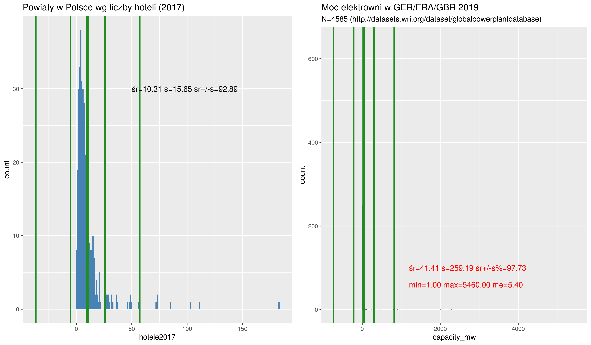

## Tablice statystyczne

**Tablica statystyczna** to (w podstawowej formie) dwukolumnowa tabela zawierająca
wartości cechy oraz odpowiadające tym wartościom liczebności.

**Przykład 1**: Tablica dla cechy niemierzalnej (nominalnej albo porządkowej)

Absolwenci studiów pielęgniarskich w ośmiu największych
krajach UE w roku 2018

**Jednostka badania**: absolwent studiów pielęgniarskich w roku 2018, 

**Badana cecha**: kraj w którym ukończył studia (nominalna)


```{r, echo=F}
members <- read.csv("eu_codes_members.csv", sep = ';', dec = ".",  header=T, na.string="NA" ) %>%
  add_row(member = 'Other', geo = "OTHER")
members.codes <- members$geo
members.big <-c ('DE', 'ES', 'FR', 'IT', 'PL', 'RO', 'NL', 'BE')

g0 <- read.csv("nursing_graduates_UE.csv", sep = ';', dec = ".",  header=T, na.string="NA" )

g1 <- g0 %>%
  filter (year == 2018 & isco08 == 'OC2221_3221' & unit == 'NR') %>%
  filter (geo %in%  members.codes) %>%
  filter (geo %in%  members.big) %>%
  mutate ( geo =  as.factor(geo)) %>%
  left_join(members, by='geo') %>%
  select (member, values)

t1 <- kable(g1, col.names = c('kraj', 'liczba'))
```

Tablica: Absolwenci studiów pielęgniarskich w ośmiu największych
krajach UE w roku 2018

```{r, echo=F}
t1
```

Źródło: Eurostat, tablica Health graduates (HLTH_RS_GRD)

**Przykład 2**: Tablica dla cechy mierzalnej (liczbowej; skokowej lub ciągłej)

Jeżeli liczba wariantów cechy jest mała tablica zawiera wyliczenie
wariantów cechy i odpowiadających im liczebności. Jeżeli liczba wariantów
cechy jest duża tablica zawiera klasy wartości (przedziały wartości)
oraz odpowiadające im liczebności.

* Co do zasady klasy wartości powinny być jednakowej rozpiętości.

* Na zasadzie wyjątku dopuszcza się aby pierwszy i ostatni przedział
były **otwarte**, tj. nie miały dolnej (pierwszy) lub górnej
(ostatni) **granicy**


Tablica: Gospodarstwa domowe we wsi X wg liczby samochodów w roku 2022

```{r, echo=F}
l.s <- c('0', '1', '2', '3 i więcej', 'razem')
n.s <- c(230, 280, 70, 5, 585)
samochody.L <- tibble(l.s, n.s) %>%
  mutate (p = n.s/585 * 100 )

t3 <- kable(samochody.L, col.names = c('liczba samochodów', 'liczba gospodarstw', '%'))
t3
```

Źródło: obliczenia własne

Tablica dla cechy mierzalnej (liczbowej ciągłej--wymaga pogrupowania w klasy):

**Przykład**: Dzietność kobiet na świecie

Współczynnik dzietności (*fertility ratio* albo FR) -- przeciętna liczba urodzonych dzieci przypadających
na jedną kobietę w wieku rozrodczym (15–49 lat).
Przyjmuje się, iż FR między 2,10–2,15 zapewnia zastępowalność pokoleń.

Dane dotyczące dzietności dla wszystkich krajów świata można
znaleźć na stronie https://ourworldindata.org/grapher/fertility-rate-complete-gapminder)
Zbudujmy tablicę przedstawiającą rozkład współczynników dzietności w roku 2018

```{r, echo=F}
dA <- read.csv("fertility_rate_2003_2018.csv", sep = ';',
  header=T, na.string="NA");
d2018 <- dA %>% filter(yr==2018)
s2018 <- summary(d2018$frate)
mean2018 <- s2018[["Mean"]]
median2018 <- s2018[["Median"]]
srednia2018 <- s2018[["Mean"]]
min2018 <- s2018[["Min."]]
max2018 <- s2018[["Max."]]
N2018 <-nrow(d2018)

q1.2018 <- quantile(d2018$frate, probs = 0.25)
q3.2018 <- quantile(d2018$frate, probs = 0.75)
```

Krajów jest `r N2018`. Wartość minimalna to `r min2018` a wartość
maksymalna to `r max2018`. Decydujemy się na rozpiętość przedziału równą 0,5;
dolny koniec pierwszego przedziału przyjmujemy jako 1,0.

Zwykle przyjmuje się za końce przedziałów **okrągłe liczby**
bo dziwnie by wyglądało gdyby koniec przedziału np. był równy 1,05
zamiast 1,0. 

Liczba przedziałów jest dobierana metodą prób i błędów, tak aby:

* nie było przedziałów z zerową liczebnością

* przedziałów nie było za dużo ani za mało (typowo 8--15)

* większość populacji nie znajdowała się w jednej czy dwóch przedziałach


Tablica: Kraje świata według współczynnika dzietności (2018)

```{r, echo=F}
## https://www.statology.org/data-binning-in-r/
d2018 <- d2018 %>% mutate(frateClass = cut(frate, breaks=seq(1, 8, by=.5)))
##levels(d2018$frateClass)

d2018s <- d2018 %>% group_by(frateClass) %>% summarise(n=n())

t2 <- kable(d2018s, col.names = c('Wsp. dzietności', 'liczba krajów'))
t2
```

Źródło: https://ourworldindata.org/grapher/fertility-rate-complete-gapminder

Każda tablica statystyczna **musi** mieć:

1. Część liczbową (kolumny i wiersze); 

   + żadna rubryka w części liczbowej nie może być pusta (żelazna zasada); w szczególności brak danych należy
     explicite zaznaczyć umownym symbolem
   
2. Część opisową:

   + tytuł tablicy; 
   + nazwy (opisy zawartości) wierszy; 
   + nazwy (opisy zawartości) kolumn; 
   + wskazanie źródła danych;
   + ewentualne uwagi odnoszące się do danych liczb.

Pominięcie czegokolwiek z powyższego jest **ciężkim błędem**. Jeżeli
nie ma danych (a często nie ma--z różnych powodów -- należy to zaznaczyć a nie
pozostawiać pustą rubrykę)

## Rozkład empiryczny

**Rozkład empiryczny** zmiennej to
przyporządkowanie wartościom zmiennej odpowiadających im liczebności
lub **częstości** (czyli udziału procentowego w całości). 

Jak taki rozkład *wygląda*? 

Rozkład wiek laureatów nagrody Nobla (od 1901 roku do 2018, N=934).
Rozkład wieku zawodników, którzy brali udział w turniejach o Puchar Świata w Rugby w latach 1999-2019 (N= 3649).

{width=80%}

Rozkłady powiatów w Polsce wg powierzchni (stan na 2017, N=380);
bez powiatów miejskich po prawej (N=380 - 66)

{width=80%}

Rozkład powiatów Polsce wg liczby hoteli (stan na 2017, N=380)
Rozkład elektrowni w Niemczech/Francji/Wlk Brytanii wg mocy (Mgw, stan na 2019, N=4586)

{width=80%}

Dane dotyczące elektrowni pochodzą z bazy
http://datasets.wri.org/dataset/globalpowerplantdatabase

Rozkłady liczebności i częstości mogą mieć postać **rozkładów skumulowanych**. Rozkład skumulowany to przyporządkowanie
dla każdej wartości zmiennej odpowiadającej jej liczebności 
oraz liczebności wszystkich wartości mniejszych 
od tej wartości (potocznie: 
dla każdego x liczba obserwacji o wartości nie większej od x).
Liczebność skumulowana dla wartości maksymalnej jest równa
liczebności populacji (lub 100% dla rozkładu częstości.)

Przykład: wiek zawodników którzy brali udział w turniejach o Puchar Świata w Rugby w latach 1999-2019 (rozkład liczebności, skumulowany
liczebności, częstości oraz skumulowany częstości)

```{r message=FALSE, echo=FALSE}
library("dplyr")
rugbysci <- read.csv("rwc1999-2019.csv", sep = ';',  header=T, na.string="NA");
#min(rugbysci$age)
#max(rugbysci$age)

breaks <- seq(min(rugbysci$age, na.rm=T), max(rugbysci$age, na.rm=T)+1, by=1)
age.cut <- cut(rugbysci$age, breaks, right=FALSE)
age.freq <- table(age.cut)

age.cfreq <- cumsum(age.freq)
age.nn <- sum(!is.na(rugbysci$age))
age.nn.na <- sum(is.na(rugbysci$age))

age.freq.p <- age.freq/age.nn * 100
age.cfreq.p <- age.cfreq/age.nn * 100

out <- data.frame(age.freq, age.cfreq, age.freq.p, age.cfreq.p) %>%
select(wiek = age.cut, N = Freq, cum = age.cfreq,  proc = Freq.1, cumproc = age.cfreq.p) %>% as.data.frame

out$wiek <- substr(out$wiek, 2, 3)

print (out, row.names=F, digits=2)
```

Czyli przykładowo było `r out$N[10]` zawodników w wieku 27 lat,
albo `r out$cum[10]` zawodników w wieku 27 i mniej lat,
albo zawodnicy w wieku 27 lat 
stanowili  `r sprintf("%.3f", out$proc[10])`% wszystkich
uczestników turnieju, albo zawodnicy w wieku 27 lat i mniej 
stanowili  `r sprintf ("%.3f", out$cumproc[10])`% wszystkich
uczestników turnieju. 

## Rozkład normalny

Cecha mierzalna ciągła to na przykład wiek mierzony z nieskończoną dokładnością. Istnieje funcja określona formułą:
$$f(x) = \frac{1}{s \sqrt{2 \pi}} \cdot \exp(-(x -m)^2/2s^2)$$

zwana **rozkładem normalnym**, która może interpolować wiele rozkładów empirycznych. Właściwością tej funkcji jest, 
że jej kształt jest zdefiniowany jedynie przez
dwa parametry: $m$ jest **średnią wartością**, 
a $s$ jest **odchyleniem standardowym** (co to jest odchylenie standardowe wyjaśniamy dalej). 
Zatem mając rozkład empiryczny
można policzyć średnią oraz odchylenie standardowe 
i w ten sposób wyznaczyć konkrety wariant **rozkładu normalnego**.

Przykładowo poniżej przedstawiono rozkład empiryczny wieku laureatów
nagrody Nobla:

```{r message=FALSE, echo=FALSE, warning=FALSE}
library("ggplot2")
library("tidyr")

dnorm.count <- function(x, mean = 0, sd = 1, log = FALSE, n = 1, binwidth = bwd){
  n * binwidth * dnorm(x = x, mean = mean, sd = sd, log = log)
}


dlnorm.count <- function(x, mean = 0, sd = 1, log = FALSE, n = 1, binwidth = bwd){
  n * binwidth * dlnorm(x = x, mean = mean, sd = sd, log = log) }

bwd <- 5
d <- read.csv("nobel_laureates3.csv", sep = ';',  header=T, na.string="NA");

d %>%
  ggplot(aes(x =  age)) +
  ##geom_histogram(binwidth =bwd,color = "white", fill = "#9FE367",boundary = 0.5) +
  geom_histogram(binwidth =bwd,color = "white", fill = "#9FE367") +
  stat_function(fun = dnorm.count, color = "#6D67E3",
                args = list(mean= mean(d$age, na.rm=T), sd = sd(d$age, na.rm=T), n = nrow(d)), lwd = 1.2) +
  scale_y_continuous(name = "Frequency") +
  scale_x_continuous(breaks=seq(0,max(d$age, na.rm=T), by=bwd))
```

niebieska krzywa to rozkład Normalny (o średniej `r mean(d$age, na.rm=T)` oraz
odchyleniu standardowym `r sd(d$age, na.rm=T)`).

Wiele rozkładów empirycznych spotykanych w otaczającej nas rzeczywistości
jest zbliżonych do rozkładu normalnego (wiek, waga, błąd pomiaru, długość itd), ale wiele zjawisk ekonomiczno-społecznych nie jest. 

Przykładowo poniżej przedstawiono rozkład empiryczny miast w Polsce
ze względu na liczbę mieszkańców (dane za Wikipedią)

```{r message=FALSE, echo=FALSE, warning=FALSE}
bwd <- 5000

towns <- read.csv("pl-towns.csv", sep = ';',  header=T, na.string="NA");

towns %>%
  ggplot(aes(x =  Pop2019)) +
  geom_histogram(binwidth =bwd, fill = "steelblue") +
  stat_function(fun = dnorm.count, color = "#6D67E3",
                args = list(mean= mean(towns$Pop2019, na.rm=T), sd = sd(towns$Pop2019, na.rm=T), n = nrow(d)), lwd = 1.2) +
  scale_y_continuous(name = "Frequency")
  #scale_x_continuous(breaks=seq(0, max(towns$Pop2019, na.rm=T), by=bwd))
```

Fioletowa krzywa to rozkład normalny 
o średniej `r sprintf ("%.1f", mean(towns$Pop2019, na.rm=T))` oraz odchyleniu standardowym `r sprintf("%.1f", sd(towns$Pop2019, na.rm=T))`.
Aproksymacja jest taka-sobie mówiąc oględnie...

Tego typu rozkładu z kolei dobrze aproksymuje inny rozkład, określany
jako **logarytmiczno-normalny**, w którym zamiast oryginalnej wartości cechy
używa się logarytmu wartości. Rozkład wielkości miast aproksymowany
rozkładem logarytmiczno-normalnym przedstawia następny przykład:

```{r message=FALSE, echo=FALSE, warning=FALSE }
towns %>%
  ggplot(aes(x =  Pop2019)) +
  geom_histogram(binwidth =bwd, fill = "steelblue") +
  stat_function(fun = dlnorm.count, color = "#6D67E3",
                args = list(mean= mean(log(towns$Pop2019), na.rm=T), sd = sd(log(towns$Pop2019), na.rm=T),
                     n = nrow(d)), lwd = 1.2) +
  scale_y_continuous(name = "Frequency")
  #scale_x_continuous(breaks=seq(0,max(towns$Pop2019, na.rm=T), by=bwd))
```

Jest mało dużych miast a dużo małych. Podobnie wyglądają rozkłady
firm/ludzi względem przychodów/zysków czy elektrowni względem mocy
zainstalowanej.

## Analiza struktury

Analiza struktury -- opisane zbiorowości ze
względu na obserwowane w badaniu cechy zmienne.

Podstawę do oceny struktury zbiorowości stanowią dane w postaci
**szeregu szczegółowego**, bądź też pogrupowane (**szereg rozdzielczy**)

Analizę prowadzić można na podstawie wykresów, szeregów
rozdzielczych oraz (najczęściej) za pomocą odpowiednio obliczonych
charakterystyk, zwanych parametrami (dla populacji) lub
statystykami (dla próby).

**Rozkład cechy** -- przyporządkowanie liczby wystąpień (liczebności, częstości lub
prawdopodobieństwa) odpowiednim wartościom cechy zmiennej.

Analiza struktury obejmuje:
**określenie tendencji centralnej** (tzw. **miary położenia** / wartość przeciętna, mediana, dominanta);
**zróżnicowanie wartości** (rozproszenie);
**asymetrię** (rozłożenie wartości wokół średniej);
**koncentrację** (podział wartości cechy pomiędzy jednostki)


## Wizualizacja danych i wykresy

**Wykresy statystyczne** są graficzną formą prezentacji materiału
statystycznego, są mniej precyzyjne i szczegółowe niż tablice,
natomiast bardziej sugestywne.

Rodzaje wykresów (podział ze względu na zastosowanie): 

**Jedna cecha**

**szeregi strukturalne**: punktowe, słupkowe, histogram, pudełkowe, kołowe;
**szeregi czasowe**: liniowe, słupkowe, punktowe;
**szeregi przestrzenne**: kartogramy.

**Dwie cechy**

wykres rozrzutu (scatter-plot), wykres liniowy liniowy


## Wykresy

Celem jest pokazanie rozkładu wartości cechy w populacji: jakie wartości występują
często a jakie rzadko, jak bardzo wartości różnią się między sobą. Jak różnią
się rozkłady dla różnych ale logicznie powiązanych populacji
(np rozkład czegoś-tam w kraju A i B albo w roku X, Y i Z).
Do tego celu stosuje się: **histogram** (albo wykres słupkowy dla skal nominalnych),
**wykres punktowy**, **wykres pudełkowy** oraz **kołowy**. Omówimy je na przykładach

## Przykład 1: Dzietność kobiet na świecie

Współczynnik dzietności -- przeciętna liczba urodzonych dzieci przypadających na jedną kobietę w wieku rozrodczym (15–49 lat). Przyjmuje się, iż FR między 2,10–2,15 zapewnia zastępowalność pokoleń.

Plik `fertility_rate_2003_2018.csv` (źródło: https://ourworldindata.org/grapher/fertility-rate-complete-gapminder) zawiera wartości współczynnika w roku 2003 oraz 2018 (czyli po 15 latach) dla 202 krajów.

```{r message=FALSE, echo=FALSE}
library("ggplot2");
require("dplyr");

dA <- read.csv("fertility_rate_2003_2018.csv", sep = ';',
  header=T, na.string="NA");

boxp <- ggplot(dA, aes(x=as.factor(yr), y=frate, fill=as.factor(yr))) +
 geom_boxplot() +
 ylab("fr") +
 xlab("rok") +
 ggtitle("Współczynniki dzietności 2003 vs 2018") +
 theme(legend.position="none")

d2003 <- dA %>% filter(yr==2003) %>% as.data.frame

s2003 <- summary(d2003$frate)
##s2003

mean2003 <- s2003[["Mean"]]
median2003 <- s2003[["Median"]]
min2003 <- s2003[["Min."]]
max2003 <- s2003[["Max."]]

N2003 <- nrow(d2003)
d2003.low <- d2003 %>% filter(frate < 2.10) %>% as.data.frame
L2003 <- nrow(d2003.low)

d2018 <- dA %>% filter(yr==2018) %>% as.data.frame

s2018 <- summary(d2018$frate)
##s2018

mean2018 <- s2018[["Mean"]]
median2018 <- s2018[["Median"]]
srednia2018 <- s2018[["Mean"]]
min2018 <- s2018[["Min."]]
max2018 <- s2018[["Max."]]

N2018 <- nrow(d2018)
d2018.low <- d2018 %>% filter(frate < 2.10) %>% as.data.frame
L2018 <- nrow(d2018.low)
```

Do oceny rozkładu wartości zmiennej służy **histogram** (por https://pl.wikipedia.org/wiki/Histogram). Jeżeli
umieścimy obok siebie dwa (lub więcej) histogramy, możemy w ten sposób
porównać (wizualnie) dwa rozkłady:

```{r message=FALSE, echo=FALSE, warning=FALSE, fig.width=10}
library("ggpubr")

h2003 <- ggplot(d2003, aes(x = frate)) + geom_histogram(binwidth = 0.25) +
 ylab("N") +
 xlab("współczynnik dzietności") +
 ggtitle("Współczynniki dzietności 2003") +
 coord_cartesian(ylim = c(0, 30), xlim=c(0,8))

h2018 <- ggplot(d2018, aes(x = frate)) + geom_histogram(binwidth = 0.25) +
 ylab("N") +
 xlab("współczynnik dzietności") +
 ggtitle("Współczynniki dzietności 2018") +
 coord_cartesian(ylim = c(0, 30), xlim=c(0, 8))
ggarrange(h2003, h2018, ncol=2, nrow=1)
```

Kształt histogramu zależy od wyboru rozpiętości przedziału; im przedział węższy
tym więcej słupków (ale ich wysokość będzie mniejsza). Poniżej przedstawiono
ten sam rozkład dla rozpiętości przedziału równej odpowiednio 0,1, 0,25 oraz 0,5:

```{r message=FALSE, echo=FALSE, warning=FALSE, fig.width=10}


h2018a <- ggplot(d2018, aes(x = frate)) + geom_histogram(binwidth = 0.1) +
 ylab("N") +
 xlab("współczynnik dzietności") +
 ggtitle("Współczynniki dzietności 2018") +
 coord_cartesian(ylim = c(0, 30), xlim=c(0, 8))

h2018b <- ggplot(d2018, aes(x = frate)) + geom_histogram(binwidth = 0.25) +
 ylab("N") +
 xlab("współczynnik dzietności") +
 ggtitle("Współczynniki dzietności 2018") +
 coord_cartesian(ylim = c(0, 30), xlim=c(0, 8))

h2018c <- ggplot(d2018, aes(x = frate)) + geom_histogram(binwidth = 0.5) +
 ylab("N") +
 xlab("współczynnik dzietności") +
 ggtitle("Współczynniki dzietności 2018") +
 coord_cartesian(ylim = c(0, 50), xlim=c(0, 8))

ggarrange(h2018a, h2018b, h2018c, ncol = 3, nrow = 1)
```

Dlatego jeżeli porównujemy różne rozkłady za pomocą umieszczonych obok siebie
histogramów to powinny one mieć: tę samą rozpiętość przedziałów, te same skale na obu osiach.

Istnieją wzory na optymalną liczbę przedziałów ale nalepszą metodą jest metoda
prób i błędów.

Czasami jeżeli liczebność populacji nie jest za duża można spróbować 
przedstawić rozkład cechy na wykresie punktowym:

```{r message=FALSE, echo=FALSE}
dp2018 <- ggplot(d2018, aes(x = reorder(symbol, frate) )) +
  geom_point(aes(y = frate, colour = 'frate' ), size=1) +
  xlab(label="kraj") +
  ylab(label="wsp. dzietności") +
  ggtitle("Wsp dzietności 2018 wg krajów świata") +
  theme(axis.text = element_text(size = 4)) +
  theme(plot.title = element_text(hjust = 0.5)) +
  coord_flip(ylim = c(0, 8))


dp2003 <- ggplot(d2003, aes(x = reorder(symbol, frate) )) +
  geom_point(aes(y = frate, colour = 'frate' ), size=1) +
  xlab(label="kraj") +
  ylab(label="wsp. dzietności") +
  ggtitle("Wsp dzietności 2003 wg krajów świata") +
  theme(axis.text = element_text(size = 4)) +
  theme(plot.title = element_text(hjust = 0.5)) +
  coord_flip(ylim = c(0, 8))

ggarrange(dp2003, dp2018, ncol=2, nrow=1)
```

**Porównanie wielu rozkładów**

Jeżeli używamy histogramu to w zasadzie jedyną opcją jest wykreślenie każdego
histogramu oddzielnie a następnie umieszczenie ich obok siebie. Wyjątkowo
można spróbować wykreślić dwa na jednym wykresie (jeżeli program, którym się posługujemy
umożliwia rysowanie kolorem przeźroczystym):

```{r message=FALSE, echo=FALSE, fig.width=10}
h2018p <- ggplot(dA, aes(x=frate, fill=as.factor(yr))) +
  ggtitle("Współczynniki dzietności 2003/2018") +
  geom_histogram(binwidth=0.1, alpha=.5, position="identity")

h2018q <- ggplot(dA, aes(x=frate, fill=as.factor(yr))) +
  ggtitle("Współczynniki dzietności 2003/2018") +
  geom_histogram(binwidth=0.25, alpha=.5, position="identity")

h2018r <- ggplot(dA, aes(x=frate, fill=as.factor(yr))) +
  ggtitle("Współczynniki dzietności 2003/2018") +
  geom_histogram(binwidth=0.5, alpha=.5, position="identity")

ggarrange(h2018p, h2018q, h2018r, ncol=3, nrow=1)

```

Łącznie na jednym wykresie (wykres punktowy):

```{r message=FALSE, echo=FALSE}
ggplot(dA, aes(x = reorder(symbol, frate) )) +
  geom_point(aes(y = frate, colour = as.factor(yr) ), size=1) +
  xlab(label="cc") + ylab(label="n ") + coord_flip()+
  ggtitle("Wsp dzietności 2003/20018") +
  theme(axis.text = element_text(size = 4)) +
  theme(plot.title = element_text(hjust = 0.5)) +
  coord_cartesian(ylim = c(0, 8)) +
  coord_flip()
```


## Przykład 2: Wykresy kołowe (Pie charts), wykresy punktowe (dot plots), histogram

Dane pochodzą z bazy danych Eurostatu są dostępne pod adresem
https://appsso.eurostat.ec.europa.eu/nui/show.do?dataset=tour_occ_nim&lang=en

Nights spent at tourist accommodation establishments by non residents (id tabeli: `tour_occ_ninat`) czyli po polsku
*Noclegi udzielone w turystycznych obiektach noclegowych* (https://ec.europa.eu/eurostat/web/products-datasets/-/tin00175;
https://stat.gov.pl/metainformacje/slownik-pojec/pojecia-stosowane-w-statystyce-publicznej/1233,pojecie.html;
https://stat.gov.pl/en/metainformations/glossary/terms-used-in-official-statistics/1233,term.html)
Poniższy rysunek przedstawia typową tabelę (wielowymarową) z danymi
dotyczącymi wykorzystania miejsc noclegowych w krajach UE. 

Nagłówek tabeli:
**TIME**, **GEO**, **Unit of measure**, **Classification of economic activities**, 
**Country of residencie** definiuje cechy stałe zbiorowści statystycznej. Dla każdej cechy zwykle możliwy jest wybór z kilku dostępnych wariantów. Tabela na rysunku przedstawia dane roczne,
dla krajów UE, dotyczące liczby noclegów w *hotels, holidays and other short-stay accomodations,
camping grounds, recreational vehicle parks and trailes parks* 
(Hotele,  Obiekty noclegowe turystyczne i miejsca krótkotrwałego zakwaterowania,
Pola kempingowe, włączając pola dla pojazdów kempingowych i pola namiotowe;
https://ec.europa.eu/eurostat/ramon/nomenclatures/index.cfm). Skrót NACE oznacza
klasyfikację działalności gospodarczej, która służy do określenia jakie miejsca noclegowe 
są uważane za **turystyczne** (bo to nie jest oczywiste).


```{r message=F, echo=F, warning=F}
library(ggplot2)
library("dplyr")
library(RColorBrewer)
library(ggpubr)

# https://www.datanovia.com/en/blog/how-to-create-a-pie-chart-in-r-using-ggplot2/
df <- data.frame( class=c("Spain", "UK", "Italy", "France", "Greece",
    "Austria", "Germany", "Croatia", "Portugal", "Netherlands", "Rest28"),
    n=c(305907462, 213378155, 210658786, 133499991, 89284386, 86044321, 83111219,
        80176804, 48884842, 44169041, 202635615));

sum.eu <-sum(df$n)
df["prop"] <- df$n / sum.eu * 100;
df["txt.prop"] <- sprintf ("%.1f", df$prop);

df <- df %>%
  arrange(desc(class)) %>%
  mutate(ypos = cumsum(prop) - 0.5*prop)

mycols <- brewer.pal(13, "Set3")

pc1 <- ggplot(df, aes(x = "", y = prop, fill = class)) +
  geom_bar(width = 1, stat = "identity", color = "white") +
  coord_polar("y", start = 0)+
   ggtitle("Nights spent at tourist..") +
  scale_fill_manual(values = mycols) +
  theme_void()

pc2 <- ggplot(df, aes(x = "", y = prop, fill = class)) +
  geom_bar(width = 1, stat = "identity", color = "white") +
  coord_polar("y", start = 0)+
   ggtitle("Nights spent at tourist..") +
  geom_text(aes(y = ypos, label = txt.prop), color = "black", size=3)+
  scale_fill_manual(values = mycols) +
  theme_void()

## dot-plot
pc3 <- ggplot(df, aes(x = reorder(class, n) )) +
  geom_point(aes(y = prop, colour = 'prop' ), size=3) +
  xlab(label="#") + ylab(label="% ") + coord_flip()+
  ggtitle("Nights spent at tourist...") +
  theme(legend.position = "none") +
  theme(plot.title = element_text(hjust = 0.5))

## bar chart
pc4 <- ggplot(df, aes(x = reorder(class, n), y=prop )) +
  geom_bar(stat="identity", fill='blue') +
  xlab(label="#") + ylab(label="% ") +
  theme(legend.position = "none") +
  coord_flip()+ ggtitle("Nights spent at tourist..") +
  theme(plot.title = element_text(hjust = 0.5))
```

Liczbę noclegów dla 10 najczęściej odwiedzanych przez turystów krajów (oraz dla reszty 
oznaczonej jako Rest28)
przestawiono na **wykresie kołowym** (https://pl.wikipedia.org/wiki/Diagram_ko%C5%82owy).
Wielkość każdego wycinka koła (pole tego wycinka albo, kąt) jest proporcjonalna do liczby noclegów w danym kraju. Stąd wykres kołowy wizualizuje **udział** (popularnie zwany procentem) każdego wycinka w całości. Możemy dodać etykiety zawierające albo ów udział (prawy wariant na 
przykładzie poniżej); albo oryginalne liczby.

```{r, message=F, echo=F, warning=F}
ggarrange(pc1, pc2, ncol = 2, nrow = 1)
```


Wykres pokazuje dobitnie wszystkie wady wykresu kołowego: niemożliwe jest określnie
różnic pomiędzy wycinkami, chybna że różnice te są ogromne. Np niemożliwe jest ustalenie
czy jak bardzo różni się udział w UK i Francji. Albo czy liczba noclewgów w Austrii
jest mniejsza/większa/równa niż w Niemczech, itd... Jeżeli dodamy liczby to sprawa się
wyjaśni (prawy wariant) tylko po co wtedy rysunek? 

Znacznie bardziej efektywne są wykresy punktowe (lewy) lub słupkowe (prawy):

```{r, echo=F, message=F}
ggarrange(pc3, pc4, ncol = 2, nrow = 1)
```

Dużo lepiej widać różnice pomiędzy krajami. Niepotrzebna jest legenda. Nazwy krajów
są na osi OY, liczba noclegów na osi OX. 
Na wykresie kołowym albo w wycinku mieściła się nazwa kraju albo procent
nie było miejsca dla obu, stąd potrzebna była legenda (utrudniająca interpretację)

Wniosek: każdy wykres kołowy można i TRZEBA zamienić na słupkowy. Wykresów kołych
nie należy stosować bo są znacznie gorszym sposobem wizualizacji 
informacji niż słupkowe.


## Przykład 3: Wykres pudełkowy

Uwaga: poniższy opis **wykresu pudełkowego** zawiera pojęcia jeszcze nie wyjaśnione (kwartyle, mediana, rozproszenie i IQR),  które opisano dokładanie dalej,
w punktach miary położenia/miary zmienności.

Konstrukcja pudełka na wykresie: 
górny/dolny bok równy kwartylom, a linia pozioma w środku pudełka równa medianie;
linie pionowe (zwane wąsami) mają długość równą Q1 minus 1,5 IQR oraz Q3 plus IQR (Q1, Q3 to kwartyle, IQR to odstęp między kwartlowy;
co to jest kwartyl, mediana i odstęp międzykwartylowy jest wyjaśnione poniżej);
Linia pozioma w połowie pudełka określa przeciętny poziom zjawiska; wysokość pudełka/wąsów
określa zmienność (im większe wąsy/wysokość tym większa zmienność).
Obserwacje nietypowe (czyli takie których wartość jest albo mniejsza od $Q1 - 1,5IQR$
albo większa od $Q3 + 1,5IQR$)są zaznaczana 
indywidualnie jako kropki nad/pod wąsami.


Ze strony komiteu Noblowskiego pobrano listę Laureatów Nagrody Nobla
Wiek laureatów nagrody Nobla w momencie przyznania 
nagrody (ponad 900 laureatów; plik `nobel_laureates3.csv`):


```{r, cache = F, echo=F, message=F, warning=FALSE}
nlf <- read.csv("nobel_laureates3.csv", sep = ';', dec = ",",  header=T, na.string="NA");

ggplot(nlf, aes(x=category, y=age, fill=category)) + geom_boxplot() + ylab("years") + xlab("");
```

Najstarsi przeciętnie: ekonomia; najmłodsi przeciętnie: fizyka. Najmniejsze zróżnicowanie:
ekonomia; największe zróżnicowanie: fizyka. 
Nie ma szans na nobla (koniec dolnego wąsa) przed pięćdziesiątką 
w ekonomii, 
przed 40-tką w literaturze, przed trzydziestką w chemii, medycynie i nagrodzie pokojowej.

Wykres niezwykle użyteczny do porównywania różnic w rozkładach wartości cechy.

## Przykład 4: wykres skrzypcowy wariant wykresu pudełkowego

In general, **violin plots** are a method of plotting numeric data and can be considered a combination of the box plot with a **kernel density plot**. In the violin plot, we can find the same information as in the box plots:
-- median; -- interquartile range;
-- the lower/upper adjacent values (defined as first quartile — 1.5 IQR 
and third quartile + 1.5 IQR respectively.)

Jako ilustrację przedstawmy rozkłady elektrowni (http://datasets.wri.org/dataset/globalpowerplantdatabase) w podziale
na wykorzystywane paliwo:
numlearnych, solarnych, na biomasę oraz węglowych.

Nukleane (rozkład w miarę symetryczny/jednomodalny.)
Zwróćmy uwagę, że wykres skrzypcowy zachowuje kształt
dzwonu tyle, że podwojonego: dwa szpiczaste końce i wybrzuszenie
w środkowej części.

```{r, cache = F, echo=F, message=F, warning=FALSE}
## wracam do elektrowni

d <- read.csv("global_pp_short.csv", sep = ';',  header=T, na.string="NA");

## wybieramy tylko Nuclear/Solar/Biomass/Oil/Coal
d <- d %>% filter(fuel == "Nuclear" | fuel == "Solar" | fuel == "Biomass"
                  | fuel == "Oil" | fuel == "Coal" )  %>% as.data.frame

## robimy małe szacher-macher żeby wykres był ładniejszy
dN <- d %>% filter(fuel == "Nuclear" & capacity_mw < 7000)  %>% as.data.frame
dS <- d %>% filter(fuel == "Solar" & capacity_mw < 150 )  %>% as.data.frame
dw <- d %>% filter(fuel == "Biomass" & capacity_mw < 150 )  %>% as.data.frame
dc <- d %>% filter(fuel == "Coal")  %>% as.data.frame

#### Nuclear
p1l <- ggplot(dN, aes(x="", y=capacity_mw)) + 
  geom_violin() + 
  geom_boxplot(width=0.1) +
  ylab("capacity/nuclear") + xlab("");

p1c <- ggplot(dN, aes(x="", y=capacity_mw)) +
  geom_boxplot() + ylab("capacity/nuclear") + xlab("");

p1r <- ggplot(dN, aes(x = capacity_mw)) + 
  geom_histogram(binwidth = 250, fill="steelblue", alpha=.6)
p1lr <- ggarrange(p1l, p1c, p1r, ncol=3, nrow=1)
##ggsave(plot=p1lr, file="PPViolinNN.png", width=11 )
p1lr
```

Solarne (rozkład skrajnie asymetryczny)
Wykres skrzypcowy dla wykresu asymetrycznego ma tylko jeden szpic.

```{r, cache = F, echo=F, message=F, warning=FALSE}
## Solar
p2l <- ggplot(dS, aes(x="", y=capacity_mw)) + geom_violin() +
  geom_boxplot(width=0.1) +
  ylab("capacity/solar") + xlab("");

p2c <- ggplot(dS, aes(x="", y=capacity_mw)) +
  geom_boxplot() + ylab("capacity/solar") + xlab("");

p2r <- ggplot(dS, aes(x = capacity_mw)) + 
  geom_histogram(binwidth = 10, fill="steelblue", alpha=.6)

p2lr <- ggarrange(p2l, p2c, p2r, ncol=3, nrow=1)
##ggsave(plot=p2lr, file="PPViolinSS.png", width=11 )
p2lr
```

Na biomasę (także asymetryczny ale o asymetrii mniejszej niż poprzedni)

```{r, cache = F, echo=F, message=F, warning=FALSE}
## Biomass
p3l <- ggplot(dw, aes(x="", y=capacity_mw)) + geom_violin() + 
  geom_boxplot(width=0.1) +
  ylab("capacity/biomass") + xlab("");

p3c <- ggplot(dw, aes(x="", y=capacity_mw)) +
  geom_boxplot() + ylab("capacity/biomass") + xlab("");

p3r <- ggplot(dw, aes(x = capacity_mw)) + 
  geom_histogram(binwidth = 10, fill="steelblue", alpha=.6)

p3lr <- ggarrange(p3l, p3c, p3r, ncol=3, nrow=1)
##ggsave(plot=p3lr, file="PPViolinBB.png", width=11)
p3lr
```

Węglowe (wielomodalny/asymetria lewostronna)
Kształt wykresu skrzypcowego dla rozkładu wielomodalnego jest pofalowany.

```{r, cache = F, echo=F, message=F, warning=FALSE}
## Coal
p4l <- ggplot(dc, aes(x="", y=capacity_mw)) + geom_violin() +
  geom_boxplot(width=0.1) +
  ylab("capacity/coal") + xlab("");

p4c <- ggplot(dc, aes(x="", y=capacity_mw)) +
  geom_boxplot() + ylab("capacity/coal") + xlab("");

p4r <- ggplot(dc, aes(x = capacity_mw)) + 
  geom_histogram(binwidth = 100, fill="steelblue", alpha=.6)

p4lr <- ggarrange(p4l, p4c, p4r, ncol=3, nrow=1)
##ggsave(plot=p4lr, file="PPViolinCC.png", width=11 )
p4lr
```

Współczynnik dzietności w latach 2003/2018 oraz współczynniki dzietności na
poszczególnych kontynentach (w roku 2018)

{width=80%}

{width=80%}


## Przykład 5: Zaufanie do Politykow

CBOS realizuje co najmniej 12 razy w roku sondaż "Aktualne problemy i wydarzenia", na reprezentatywnej ok. 1000-osobowej próbie dorosłych mieszkańców Polski. (cf https://www.cbos.pl/PL/trendy/trendy.php?)

```{r, cache = F, echo=F, message=F, warning=FALSE}
require("tidyr");

dA <- read.csv("zaufanie_do_politykow_CBOS_2019.csv", sep = ';',  header=T, na.string="NA");

## kto;zaufanie;diffz;nieuf;diffn;obojetnosc;nieznajomosc

## https://stackoverflow.com/questions/17148679/construct-a-manual-legend-for-a-complicated-plot
cols <- c("zaufanie"="blue","nieufnosc"="red","nieznajomosc"="black")

p1 <- ggplot(dA, aes(x = reorder(kto, zaufanie) )) +
  geom_point(aes(y = zaufanie, colour="zaufanie"), size=3 ) +
  geom_point(aes(y = nieuf, colour="nieufnosc" ), size=3 ) +
  geom_bar(stat = 'identity', 
           aes(y = nieznajomosc, fill="nieznajomosc" ), alpha=.3 ) + 
  xlab(label="") + 
  ylab(label="%") + 
  ggtitle("Zaufanie do polityków 1/2019") +
  theme(axis.text = element_text(size = 8)) +
  theme(legend.position="top") +
  theme(plot.title = element_text(hjust = 0.5)) +
  ###coord_cartesian(ylim = c(0, 8)) +
  ##scale_fill_manual(values = c("blue", "red", "black")) +
  scale_colour_manual(name="",values=cols) + 
  scale_fill_manual(name="",values=cols) +
  coord_flip()

### https://www.guru99.com/r-dplyr-tutorial.html#9
### Ordering factor
dA$sortOrder <- dA$zaufanie

dB <- dA %>% gather(aspekt, vv, zaufanie:nieznajomosc) %>% 
   filter(aspekt=="zaufanie" | aspekt =="nieuf" | aspekt == "nieznajomosc") %>% as.data.frame

p2 <- ggplot(dB, aes(x = reorder(kto, sortOrder), y=vv, fill=aspekt )) +
  ggtitle("Zaufanie do polityków 1/2019") +
  theme(legend.position="top") +
  xlab(label="") + 
  ylab(label="") + 
  geom_bar(position="stack", stat="identity") +
  coord_flip()

### wariant z linią bazową pośrodku (lewa-prawa)
dA$nieuf <- -dA$nieuf
dA$nieznajomosc <- -dA$nieznajomosc

dC <- dA %>% gather(aspekt, vv, zaufanie:nieznajomosc) %>%
   filter(aspekt=="zaufanie" | aspekt =="nieuf" | aspekt == "nieznajomosc") %>% as.data.frame

p2A <- ggplot(dC, aes(x = reorder(kto, sortOrder), y=vv, fill=aspekt )) +
  ggtitle("Zaufanie do polityków 1/2019") +
  theme(legend.position="top") +
  xlab(label="") +
  ylab(label="") +
  geom_bar(position="stack", stat="identity") +
  coord_flip()

## Faceted piechart
##
p3 <- ggplot(dB,aes(x = "", y=vv, fill=factor(aspekt))) +
  ggtitle("Zaufanie do polityków 1/2019") +
  xlab(label="") +
  ylab(label="") +
  facet_wrap(~kto) +
  geom_bar(width = 1,position = "fill", stat="identity") +
  coord_polar(theta="y")

## Faceted piechar
## http://zevross.com/blog/2019/04/02/easy-multi-panel-plots-in-r-using-facet_wrap-and-facet_grid-from-ggplot2/
p3 <- ggplot(dB,aes(x = "", y=vv, fill=factor(aspekt))) + 
  ggtitle("Zaufanie do polityków 1/2019") +
   theme(legend.position="top") +
  xlab(label="") + 
  ylab(label="") + 
  facet_wrap(~kto, ncol=8) + 
  geom_bar(width = 1,position = "fill", stat="identity") + 
  coord_polar(theta="y")

## Faceted barchart
p3A <- ggplot(dB, aes(x =kto , y=vv, fill=aspekt )) +
  ggtitle("Zaufanie do polityków 1/2019") +
  theme(legend.position="top") +
  xlab(label="") +
  ylab(label="") +
  facet_wrap(~aspekt) +
  geom_bar(stat="identity") +
  coord_flip()
```

Częścią tych badań jest badanie zaufania do Polityków. Które to zaufanie
jest mierzone w taki sposób, że respondenci odpowiadają na jedno pytanie,
które brzmi: *Ludzie aktywni publicznie – swoim zachowaniem, tym, co mówią, do czego dążą – budzą mniejsze lub większe
zaufanie. Przedstawimy teraz Panu(i) listę osób aktywnych w życiu politycznym naszego kraju. O każdej z nich proszę powiedzieć,
w jakim stopniu budzi ona Pana(i) zaufanie. Odpowiadając, proszę posłużyć się skalą, na której –5 oznacza, że osoba ta budzi
w Panu(i) głęboką nieufność, 0 – że jest ona Panu(i) obojętna, a +5 oznacza, że ma Pan(i) do tej osoby pełne zaufanie. Oczywiście
może się Pan(i) posługiwać innymi ocenami tej skali. Jeżeli kogoś Pan(i) nie zna, proszę powiedzieć*

Odsetki badanych wyrażających zaufanie – wskazania punktów od +1 do +5, nieufność – wskazania punktów od –1 do –5,
obojętność – 0

W zestawieniu CBOS pomija odpowiedzi „trudno powiedzieć” 
i odmowy odpowiedzi. 

Analiza CBOS (przykład raportu jest 
w pliku `zaufanie_do_politykow_CBOS_2019.pdf`) posługuje się 
skumulowanym wykresem słupkowym (*stacked barchart*):

```{r cache = F, echo=F, message=F, warning=FALSE, fig.width=10}
ggarrange(p2, p2A, ncol = 2, nrow = 1)
```

Skumulowany wykres słupkowy jest w zasadzie jest wykresem kołowym,
tyle że zamiast kółek są prostokąty (cf https://eagereyes.org/techniques/stacked-bars-are-the-worst). 
Można łatwo porównywać 
łączną wartość albo wartość przedstawioną za pomocą pierwszego słupka
(bo mają wspólną linię dla wartości zero, *common baseline*).
Pozostałe słupki nie są oparte o wspólną linię zerowej wartości i w związku
z tym porównanie ich wartości jest trudne.
W  przykładzie każdy słupek ma 3 kategorie a już jest trudno 
wskazać czy nieufność do Pawła Kukiza jest większa czy mniejsza od nieufności
do Roberta Biedronia. Gorzej wykres sugeruje, że nieufność do Biedronia
jest większa niż do Kukiza, podczas gdy w rzeczywistości jest odwrotnie.
Podobnie trudno jest określić dla konkretnego polityka czy zaufanie jest większe od nieufności albo o ile jest większe (lub mniejsze)..

Można trochę poprawić
wykres jeżeli wartości podzielimy na ujemne/dodatnie 
(wykres po prawej). Można ale po co? Najlepiej po prostu wykreślić
oddzielne wykresy słupkowe dla każdej kategorii czyli wykreślić
słupki z każdej kategorii oddzielniem na wspólnej linii zera:

```{r cache=F, echo=F, message=F, warning=FALSE}
p3A
```

Wykres kołowy kolejny raz jest najmniej przydatny. Niemożliwe albo
bardzo trudne jest zorientowanie się w różnicach odsetka zaufania/nieufności/nieznajmości dla poszczególnych kandydatów:

```{r cache = F, echo=F, message=F, warning=FALSE, fig.width=10}
p3
```

Można spróbować połączyć wykres punktowy z wykresem słupkowym:

```{r cache = F, echo=F, message=F, warning=FALSE}
p1
```

Patrząc na słupki można ocenić nieznajomość;
patrząc na kropki zaufanie/nieufność. W porówaniu do skumulowanego
wykresu słupkowego zarówno łatwe jest porównanie poziomów każdego 
czynnika dla wszystkich ocenianych
polityków, jak i porównanie dla konkretnego polityka (czy zaufanie jest większe od nieufności albo o ile jest większe/mniejsze). Ale uwaga jeżeli
liczba wymiarów będzie większa niż trzy wykres straci 
na przejrzystości zamieniając się w chmurę różnokolorowych kropek.

## Przykład 6: Marimekko mosaic chart

Przykład: Kraje wg emisji C02 (wysokość prostokąta jest równa emisji per capita; szerokość liczbie ludności). Pola prostokątów odpowiadają globalnej
emisji, wysokości emisji na głowę. Prostokąty są uszeregowane wg. emisji per capita, co utrudnia porówania wielkości globalnych. Ale i tak widać, że nie tylko Polska emituje mniej niż Niemcy ale przeciętny Niemiec emituje więcej
niż przeciętny spalający na potęgę czarny węgiel Polak.

{width=80%}


## Analiza parametryczna

## Miary położenia

Miary przeciętne charakteryzują średni lub
typowy poziom wartości cechy. Są to więc takie wartości, wokół których
skupiają się wszystkie pozostałe wartości analizowanej cechy.

{width=85%}

Na rysunku po lewej mamy dwa rozkłady różniące się poziomem przeciętnym (czerwony ma przeciętnie mniejsze wartości niż turkusowy). Są to rozkłady jednomodalne, tj. wartości skupiają się wokół jednej wartości. Dla takich rozkładów ma sens obliczanie średnich. 

Na rysunku po prawej mamy rozkłady nietypowe: wielomodalne (turkusowy) lub niesymetryczne
(wartości skupiają się nie centralnie ale po prawej/lewej od środka przedziału zmienności).

W świecie rzeczywistym zdecydowana większość rozkładów jest jednomodalna.

Klasyczne (**średnia arytmetyczna**) i pozycyjne (**mediana**, **dominanta**, 
kwartyle, kwantyle, decyle).  

Średnia artmetyczna (*Mean*, *Arithmetic mean*).
Oblicznie średniej dla szeregu prostego (suma wartości podzielona 
przez liczbę składników sumy):
$$
\bar x = \frac{\sum_{i=1}^N x_i} {N}
$$


**Mediana** (*Median*, kwartyl drugi) dzieli zbiorowość na dwie równe części; połowa
jednostek ma wartości cechy mniejsze lub równe medianie, a połowa
wartości cechy równe lub większe od Me. Stąd też mediana bywa nazywana
wartością środkową.

**Właśności mediany** -- odporna na wartości nietypowe (w przeciwieństwie do średniej)

**Przykład: współczynnik dzietności na świecie w roku 2018**

Średnia wartość współczynnika `r mean2018`; mediana -- `r median2018`. 
Interpretacja średniej:
wartość współczynnika dzietności wyniosła `r mean2018` dziecka. Uwaga:
średnia dzietność na świecie **nie wynosi** `r mean2018` (bo kraje różnią się liczbą ludności). Interpretacja mediany: dzietność kobiet w połowie krajów na świecie
wynosiło `r median2018` i mniej. Uwaga: dzietność połowy kobiet na świecie wyniosła
`r median2018` i mniej jest niepoprawną interpretacją (różne wielkości krajów.)

**Generalna uwaga**: interpretacja średniej-średnich często jest nieoczywista i należy uważać.
(a współczynnik dzietości jest średnią: średnia liczba dzieci urodzonych przez kobietę 
w wieku rozrodczym. Jeżeli liczymy średnią dla 202 krajów, to mamy *średnią-średnich*).
Inny przykład: odsetek ludności w wieku poprodukcyjnym wg powiatów (średnia z czegoś takiego nie da nam odsetka ludności w wieku poprodukcyjnym w Polsce, 
bo powiaty różnią się liczbą ludności.)

**Dominanta** (*Mode*, Moda, wartość modalna, wartość
najczęstsza) jest to wartość cechy statystycznej, która w szeregu
empirycznym występuje najczęściej. W szeregach prostych
i rozdzielczych jest to wartość cechy, której odpowiada największa
liczebność (częstość).

**Kwartyle** (Q, *quartile*, $Q_1$, $Q_3$) -- wartości cechy dla jednostek
dzielących populację na cztery równe części. Kwartyl pierwszy dzieli
populację w proporcji 25/75%, kwartyl drugi w proporcji 50/50%, a kwartyl trzeci w proporcji 75/25%. 
**kwantyle** (D, wartości dziesiętne), podobnie jak kwartyle, tyle że dzielą na 10 części.
**Centyle** (P, wartości setne), podobnie jak kwantyle tyle że dzielą na 100 części.
Przykładowo wartość 99 centyla 
i mniejszą ma 99% jednostek w populacji.

## Miary zmienności

Wariancja, odchylenie standardowe, odchylenie przeciętne, współczynnik
zmienności (Pearsona)

**Wariancja** (*variance*) jest to średnia arytmetyczna kwadratów
odchyleń poszczególnych wartości cechy od średniej arytmetycznej
zbiorowości.

Oblicznie wariancji dla szeregu prostego:

$$
S^2 = \frac{1}{N} \sum_{i=1}^N (x_i - \bar x)^2
$$

często zamiast dzielenie przez $N$ dzielimy przez $N-1$.

**Odchylenie standardowe** (*standard deviation*, sd) jest
pierwiastkiem kwadratowym z wariancji.  Parametr ten określa
przeciętne zróżnicowanie poszczególnych wartości cechy od średniej
arytmetycznej.

Współczynniki pozycyjne. Odchylenie ćwiartkowe (Q, *midhinge*):
$$
Q = \frac{Q_3 - Q_1}{2}
$$
i rozstęp ćwiartkowy (*interquartile range*, IQR):
$$
R_Q = Q_3 - Q_1
$$

**Współczynnik zmienności** jest ilorazem bezwzględnej miary
zmienności cechy i średniej wartości tej cechy. W analizie struktury
korzysta się z różnych miar położenia i zmienności, dlatego są
współczynniki zmienności klasyczne i pozycyjne.

Współczynniki klasyczne:

$$
V_s = \frac{s}{\bar x}\qquad \textrm{lub}\qquad 
V_d = \frac{d}{\bar x}
$$
pozycyjne
$$
V_Q = \frac{Q_3 - Q_1}{\textrm{Me}}
$$
albo (*Quartile coefficient of dispersion*):
$$
V_Q = \frac{Q_3 - Q_1}{Q_3 + Q_1}
$$

**Współczynnik zmienności** jest wartością niemianowaną.  Wartości
liczbowe współczynników zmienności najczęściej są podawane
w procentach.  Przyjmuje się, że jeżeli współczynnik zmienności jest
poniżej 10%, to cechy wykazują zróżnicowanie statystycznie nieistotne.
Duże wartości tego współczynnika świadczą o dużym zróżnicowaniu, a
więc niejednorodności zbiorowości.

Współczynnik zmienności stosuje się zwykle w porównaniach, gdy chce
się ocenić zróżnicowanie: kilku zbiorowości pod względem tej samej
cechy, tej samej zbiorowości pod względem kilku różnych cech. 

UWAGA: ten współczynnik może dawać dziwne rezulataty jeżeli średnia wynosi zero
(niezdefiniowany), jest ujemna lub jest bliska zera; zwłaszcza jeżeli użyjemy skali
przedziałowej. Przykład:

```
Średnie temperatury miesięczne. Sopot, Polska

mc   2010	 2011	 2012	 2013	 2014	 2015	 2016	 2017	 2018	 2019		Tm	Sm	    Vm
01	-5.36	-0.41	-0.37	-1.77	-2.27	 1.53	-2.39	-1.16	 0.62	-0.31	-0.74	2.23 -299.54
02	-1.08	-3.19	-3.31	-0.13	 2.55	 1.44	 2.72	-0.08	-2.56	 3.27	-0.04	2.36 -6658.52
03	 3.65	 2.83	 5.04	-0.87	 6.09	 4.91	 4.09	 5.04	-0.07	 5.26	3.60	2.21	61.57
04	 7.47	 9.47	 7.59	 6.55	 9.37	 7.94	 8.30	 6.70	10.43	 8.62	8.25	1.19	14.37
05	10.85	12.78	13.11	14.10	12.82	12.01	14.37	12.77	15.40	11.56	12.98	1.29	9.95
06	16.06	17.65	14.91	17.15	15.37	15.36	17.62	16.18	17.51	20.03	16.78	1.45	8.65
07	20.49	18.11	18.07	18.53	20.51	17.52	18.51	16.84	20.20	17.17	18.59	1.29	6.94
08	18.71	17.58	17.66	18.11	17.70	19.47	17.36	17.53	19.46	18.65	18.22	0.76	4.15
09	13.03	14.79	13.91	12.38	14.41	14.16	15.53	13.47	15.04	13.69	14.04	0.90	6.44
10	 6.24	 9.27	 8.23	 9.93	 8.78	 7.78	 7.76	10.05	10.17	 9.70	8.79	1.21	13.81
11	 4.54	 4.54	 5.03	 5.50	 4.89	 6.01	 3.51	 4.76	 4.88	 5.27	4.89	0.63	12.83
12	-5.03	 3.00	-1.70	 3.40	 1.02	 4.56	 2.67	 2.18	 2.05	 3.54	1.57	2.73	174.09

Tm -- średnia dla lat 2010-2019
Sm -- odchylenie standardowe dla lat 2010--2019
Vm -- współczynnik zmienności tj Vm = Sm / Tm * 100
```
Dla lutego współczynnik zmienności przymuje absurdalną wartość 6 tysięcy (procent).
Do tego na minus.

## Miary asymetrii

Asymetria (*skewness*), to odwrotność symetrii. Szereg jest symetryczny
jeżeli jednostki są rozłożone ,,równomiernie'' wokół wartości średniej:
$$
\bar x = \textrm{Me} = D
$$
Asymetria prawostronna, lewostronna; wskaźnik asymetrii (skośności),
współczynniki asymetrii (skośności).

**Moment trzeci centralny** -- średnia arytmetyczna z podniesionych do potęgi
trzeciej odchyleń wartości cechy od średniej arytmetycznej
$$
\mu_3 = \frac{1}{N} \sum_{i=1}^N (x_i - \bar x)^3
$$
jeżeli $\mu_3 = 0$ szereg symetryczny,
$\mu_3 > 0$ asymetria dodatnia (prawostronna),
$\mu_3 < 0$ asymetria ujemna (lewostronna)

Moment trzeci względny określa siłę i kierunek asymetrii:
$$
g_1 =  \frac{\mu_3}{s^3}
$$
Na podstawie badań empirycznych: $-2 < g_1 < 2$,
w skrajnych przypadkach może przekraczać ten przedział.

Współczynnik asymetrii (skośności) oparty na 
odległościach między średnimi (K. Pearson).
$$
W_s =  \frac{\bar x - D}{s}
$$
rzadziej używa się:
$$
W_s =  \frac{\bar x - \textrm{Me}}{s}
$$
Współczynnik asymetrii (skośności) oparty na odległościach między kwartylami
lub decylami:
$$
W_{sq} =  \frac{(Q_3 - Q_2) - (Q_2 - Q_1)}{Q_3 - Q_1}
$$

## Miary koncentracji

**Koncentracja** -- nierównomierny podział wartości cechy w zbiorowości.

*Współczynnik Giniego i Krzywa Lorenza*

**Krzywa Lorenza** jest funkcją określoną na zbiorze liczb dodatnich L(Cn),
gdzie Cn jest kumulowaną liczebnością zaś L kumulowaną wartość cechy.
Zwykle wartości kumulowane są przedstawione w procentach co pozwala
na zgrabną interpretację w stylu:
20% jednostek ma 5% łącznej wartości cechy albo 50% rolników posiada 15% łacznych
areałów, itp.

{width=80%}

przekątna łącząca lewy-dolny, prawy-górny wierzchołek jest nazywana linią
równomiernego rozkładu (koncentracji równomiernej, *line of equality*).
**Współczynnik Giniego** to iloraz pola A do sumy pół A+B. 

Im większa koncentracji, tym krzywa Lorenza jest bardziej wygięta, a wartość
współczynnika Ginego większa (maksymalną wartością jest 1)

*Współczynnik HH*

Innym współczynnikiem koncentracji jest współczynnik Herfindahla-Hirschmana 
(HH-Index, https://en.wikipedia.org/wiki/Herfindahl%E2%80%93Hirschman_Index):

$$HH = \sum_{i=1}^N x_i^2, \quad\mathrm{gdzie}: \sum_{i=1}^N x_i =100%$$
Maksymalną wartością tego współczynnika jest 10000, wartości większe od 1800
świadczą o znacznej koncentracji.

