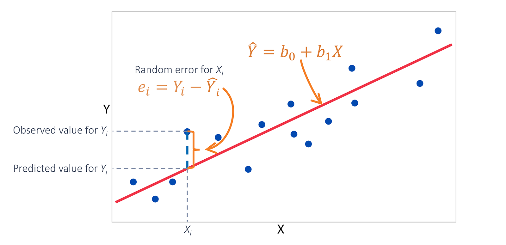

# Analiza szeregów czasowych

## Pojęcia wstępne

**Szereg czasowy** to ciąg pomiarów z kolejnych momentów/okresów czasu.

**Szereg czasowy** jest **szeregiem okresów** jeżeli dotyczy **strumieni** (zasobów).
Przykładowo liczba urodzeń żywych w powiecie kwidzyńskim w latach 2010--2019,
to **szereg okresów**.
W szczególności można dodać liczbę urodzeń
w poszczególnych latach otrzymując łączną liczbę urodzonych w tym okresie.

```
Urodzenia żywe w powiecie kwidzyńskim w latach 2010--2019 
2010  | 2011 | 2012 | 2013 | 2014 | 2015 | 2016 | 2017 | 2018 |  2019
------+------+------+------+------+------+------+------+------+------
 965  |  937 | 907  | 821  |  831 |  785 |  813 |  861 |  834 |   833
Źródło: https://bdl.stat.gov.pl/
```
W latach 2010--2019 w powiecie kwidzyńskim urodziło
się 965 + 937 + ... + 833 = 8587 dzieci (średnio 858,7 rocznie).

Albo **szereg czasowy** jest **szeregiem momentów** jeżeli dotyczy **stanów**.
Przykładowo liczba ludności powiatu kwidzyńskiego w latach 2010--2019 (stan na 31.12),
to **szereg czasowy momentów**.

```
Ludność ogółem w powiecie kwidzyńskim w latach 2010--2019 
2010  | 2011 |  2012 | 2013 | 2014 | 2015 | 2016 | 2017 | 2018 |  2019
------+------+-------+------+------+------+------+------+------+------
83562 |83734 | 83783 |83611 |83627 |83464 |83495 |83423 |83291 | 83174
Źródło: https://bdl.stat.gov.pl/
```

(Zwróćmy uwagę że taki szereg zwykle w tytule ma magiczną formułę
stan na *dzień-miesiąc* -- w przykładzie stan na ostatni dzień roku)
Nie można sumować liczby mieszkańców z kolejnych lat, bo taka suma nie ma merytorycznie sensu.
Można podać średnią (przeciętny stan) ludności jako wartość średniej chronologicznej:

$$\bar x_{ch} = (\frac{1}{2} x_1 + x_2 + ... + x_{n-1} +
\frac{1}{2} x_{n} ) / (n-1) = (83562/2 + 83734 + ... + 83291 + 83174/2)/9 = 83532,9$$

Średnia roczna liczba ludności w powiecie kwidzyńskim w latach 2010--2019 wyniosła zatem 83532,9 mieszkańców.

Szeregi czasowe mogą różnić się częstotliwością (dzienna, tygodniowa, miesięczna, kwartalna, roczna).

## Wykresy

W przypadku szeregów czasowych celem wizualizacji jest: pokazanie poziomu
zjawiska, jego dynamiki (spada, rośnie, zmienia się cyklicznie), porównanie poziomów/dynamiki wielu zmiennych.

Do wizualizacji szeregów czasowych należy stosować wykresy liniowe, słupkowe lub punktowe,

### Przykład: Zwiedzający Muzeum Zamkowe w Malborku

Liczbę zwiedzających Muzeum Zamkowe w Malborku w latach 2015--2019 (dane miesięczne)
przedstawiono na wykresach

```{r message=FALSE, echo=F, warning=FALSE, fig.width=10}
dane <- read.csv(file= "MZM.csv", header=T, sep=";");

p1 <- ggplot() +
  geom_point(data=dane, mapping=aes(x=as.Date(data), 
                  y=razem, colour="razem"), alpha=.5, size=2) +  
  geom_point(data=dane, mapping=aes(x=as.Date(data), 
                      y=krajowi, colour="krajowi"), alpha=.5, size=2) +  
  ylab(label="zwiedzający") +
  xlab(label="") +
  theme(legend.position="top") +
  theme(legend.title=element_blank()) 

p2 <- ggplot() +
geom_line(data=dane, mapping=aes(x=as.Date(data), y=razem, colour="razem"), alpha=.5, size=1) +  
  geom_line(data=dane, mapping=aes(x=as.Date(data), y=krajowi, colour="krajowi"), alpha=.5, size=1) +  
  ylab(label="zwiedzający") +
  xlab(label="") +
  theme(legend.position="top") +
  theme(legend.title=element_blank()) 

p3 <- ggplot() +
geom_bar(data=dane, mapping=aes(x=as.Date(data), y=razem, fill="razem", stat = 'identity'), stat = 'identity', alpha=.5, size=1) +  
geom_bar(data=dane, mapping=aes(x=as.Date(data), y=krajowi, fill="krajowi", stat = 'identity'), stat = 'identity', alpha=.5, size=1) +  
  ylab(label="zwiedzający") +
  xlab(label="") +
  theme(legend.position="top") +
  theme(legend.title=element_blank()) 

daneC <- dane %>% gather(kat, liczba, razem:krajowi) %>%
   filter(kat=="razem" | kat =="krajowi") %>% as.data.frame

p4 <- ggplot(data=daneC, aes(x=as.Date(data), y=liczba, fill=kat)) +
   geom_bar(stat = 'identity', position=position_dodge(), alpha=.5, size=1) +  
  ylab(label="zwiedzający") +
  xlab(label="") +
  theme(legend.position="top") +
  theme(legend.title=element_blank()) 


ggarrange(p1, p2, p3, p4, ncol = 2, nrow = 2)
```

Wykres kropkowy zwykle się nie sprawdza. Jeżeli przebieg zjawiska nie jest uporządkowany,
albo wykres zawiera kilka zmiennych (w przykładzie dwie zmienne).
to wynikiem jest chmura różnokolowych kropek, w której trudno się połapać.

Wykres liniowy zwykle daje najlepsze rezultaty.

Wykres słupkowy z półprzeźroczystymi słupkami też zwykle się nie sprawdza
(w przykładzie jeden słupek zawsze zachodzi na drugi, co w rezultacie prowadzi do sytuacji,
że turkusowego koloru w ogóle nie ma na wykresie)

Wykres słupkowy ze słupkami przylegającymi do siebie (grupowany) jest dobrą alternatywą dla wykresu liniowego.


## Przyrosty

Oznaczmy wartość zmiennej $Y$ w okresie $t$ jako $y_t$ (mówi się okres badany)
oraz wartość zmiennej $Y$ w okresie $0$ jako $y_0$ (okres podstawowy).

Przyrost absolutny to po prostu $y_t - y_0$. Jeżeli obliczamy przyrosty dla wielu okresów, to można porównywać
zawsze do jednego okresu/momentu:

$$y_2 - y_1, y_3 - y_1, \ldots, y_{n-1} - y_1, y_{n} - y_1$$

lub dla poprzedniego okresu/momentu

$$y_2 - y_1, y_3 - y_2, \ldots, y_{n-1} - y_{n-2}, y_{n} - y_{n-1}$$

W pierwszym przypadku mówimy o przyrostach jednopodstawowych, w drugim zaś o przyrostach łańcuchowych. Zwróćmy
uwagę, że podstawa nie musi być równa pierwszej wartości. Może to być np. wartość ostatnia lub środkowa:

$$y_1 - y_n, y_2 - y_n, \ldots, y_{n-2} - y_n, y_{n-1} - y_n$$

Interpretacja: o ile wzrosła/spadła wielkość zjawiska w okresie badanym w porównaniu do podstawowego
w jednostkach zmiennej $Y$ oczywiście.

Przyrost względny to $(y_t - y_0)/y_0$  Jeżeli obliczamy przyrosty dla wielu okresów, to podobnie jak
przyrosty absolutne możemy się posługiwać  indeksami jednopodstawowymi lub łańcuchowymi.

Przyrost względny zwykle wyrażone są w procentach jeżeli $y_t = 115$ a $y_0 = 100$, to
$(y_t - y_0)/y_0 \cdot 100 =115 $. Zjawisko ma o 15% wyższy poziom w roku $t$.

Wskaźniki dynamiki (indeksy): określają względną zmianę wartości
szeregów czasowych (popularny procent zmiany), czyli $y_t/y_0$.
Jeżeli podstawą porównań jest okres poprzedni $y_t/y_{t-1}$ to indeks nazywany jest **łańcuchowym**, jeżeli
podstawa porównań jest stała, tj. $y_t/y_{c}$, to indeks nazywany jest **jednopodstawowy**.

Indeks zwykle wyrażone są w procentach jeżeli $y_t = 115$ a $y_0 = 100$, to
$y_t/y_0 \cdot 100 =15 $. Zjawisko ma o 15% wyższy poziom w roku $t$.


Używamy średniej geometrycznej do obliczenia średniego tempa zmian zjawiska w czasie:

$$\bar y_g = \sqrt[n-1]{y_n/y_1}$$


Przykład: Zwiedzający Muzeum Zamkowe w Malborku


## Indeksy agregatowe

Jeżeli celem jest porównanie wielu różnych dóbr należy znaleść wspólny mianownik, którym jest zwykle
cena albo koszty. Załóżmy że jest to cena. Dysponujemy informacją na temat wielkości sprzedaży
pewnej grupy $i$ dóbr w okresie $1$, tj. $q_{1i}$ oraz w okresie $0$, tj. $q_{0i}$.
Dysponujemy także informacją na temat cen tych 
 $i$ dóbr w okresie $1$, tj. $p_{1i}$ oraz w okresie $0$, tj. $p_{0i}$.

Agregatowy indeks wartości jest definiowany jako:

$$I_w = \frac{\sum_i q_{1i} p_{1i}}{ \sum_i q_{0i} p_{0i}}

Indeks ten określa jak widać zmianę względną wartości grupy towarów w okresie $1$ w porówaniu
do okresu $0$. 

Można też szacować wpływ zmiany cen i ilości towarów oddzielnie stosując następujące formuły

agregatowy indeks ilości Laspeyresa: $I^L_q = \frac{\sum_i q_{1i} p_{0i}}{ \sum_i q_{0i} p_{0i}}$

agregatowy indeks ceny Laspeyresa: $I^L_p = \frac{\sum_i q_{0i} p_{1i}}{ \sum_i q_{0i} p_{0i}}$

agregatowy indeks ilości Paaschego: $I^P_q = \frac{\sum_i q_{1i} p_{1i}}{ \sum_i q_{0i} p_{1i}}$

agregatowy indeks ceny Paaschego: $I^P_p = \frac{\sum_i q_{1i} p_{1i}}{ \sum_i q_{0i} p_{1i}}$

Interpretacja: przy przyjęciu poziomu cen z okresu $x$ ceny/ilości zmieniły się o $y$ procent.
Co jest $x$em zależy od przyjętej formuły standaryzacyjnej.

## Dekompozycja szeregów czasowych

Najczęściej stosowanym modelem szeregu czasowego dla zjawisk ekonomiczno-społecznych jest
traktowanie go jako **sumy** (lub iloczynu) trzech składników: ogólnej, wieloletniej tendencji
cyklicznych wahań okresowych oraz czynników pozostałych:
$$Y_t = T_t + S_t + e_t$$
Ogólna, wieloletnia tendencja zwana jest trendem, zaś cyklicznych wahań okresowych
potocznie określane są jako **sezonowość**.
Sezonowość jest typowym atrybutem wielu kategorii ekonomicznych i wynika
ze zmienności warunków przyrodniczych czy
też systemu społeczno-prawnego (okres urlopowy, koniec roku finansowego itd.)

Metody wyodrębniania tendencji rozwojowej (trendu): średnia ruchoma, 
liniowa funkcja trendu, wygładzanie wykładnicze.

**Sezonowość a ocena kierunku/wielkości zmiany wartości szeregu czasowego**:
wyciąganie wniosków na podstawie **wyłącznie** porównywania obserwacji w kolejnych okresach w szeregu czasowym
cechującym się sezonowością jest
albo przejawem niewiedzy albo manipulacji (zwykle motywowanej politycznie). Na przykład wiadomo, że wielkość zatrudnienia wykazuje
wahania sezonowe, bo w zimie zapotrzebowanie na pracowników spada. Stąd na przykład zatrudnienie w pierwszym kwartale
(prawie) zawsze będzie niższe niż w czwartym kwartale roku poprzedniego.
Jeżeli ktoś *sprzedaje* ten fakt jako argument,
że rząd sobie nie radzi z gospodarką, to mamy do czynienia z manipulacją.
Należy w takiej sytuacji porównywać rok-do-roku (czyli kwartał-do-kwartału dla danych kwartalnych),
lub porównywać dane **odsezonowane**, czyli takie, które zostały poddane transformacji usuwającej efekt wahań sezonowych.
Nb. **odsezonowanie** zawsze pozostawia pole do manipulacji w postaci konkretnej metody **odsezonowania**.
Dlatego osobiście wolę porównywać
dane z **okresów jednoimiennych** (porównanie rok-do-roku) co i państwu radzę:-)

## Wygładzanie za pomocą średniej ruchomej

Koncepcyjnie bardzo prosta metoda: obliczamy **średnią** dla kolejnych $k$ wartości
szeregu czasowego. Obliczone wartości zastępują wartości oryginalne.
Wartości średniej ruchomej $k$-elementowej są obliczane jako:
$$\bar y_p = (x_p + x_{p+1} + x_{p+2})/3, \textrm{gdzie: } p=1,\dots, N-2$$

Rezultatem jest szereg skrócony dokładnie o $N-2$ elementów, gdzie $N$ jest liczbą elementów
szeregu oryginalnego. Jest też problem z określeniem okresu, którego dotyczą obliczone wartości.
Czy $\bar y_1$ to obserwacja dla pierwszego, drugiego czy trzeciego okresu?
W zasadzie każdy wariant będzie OK, zwykle wybiera się element środkowy.
Dla danych miesięcznych i $k=12$ szereg wygładzony będzie krótszy o 11 obserwacji i nie ma elementu środkowego
(są dwa środkowe: czerwiec i lipiec). Można kompliować metodę i liczyć średnią ze środkowych albo zdecydować się 
na przypisanie średniej wartości do czerwca albo do lipca.
Takie to są uroki średniej ruchomej...

## Liniowa funkcja trendu

Metoda zakładająca, że trend ma postać funkcji liniowej postaci $Y=b1\dot t +b0$. Parametry tej funkcji są obliczane
metodą najmniejszych kwadratów, w której minimalizuje się sumę
kwadratów odchyleń wartości empirycznych (*observed values*) od
wartości teoretycznych (*predicted values*), tj.
$\sum_i^N y - \hat y \Rightarrow \min $, 
gdzie $\hat y$ to wartości teoretyczne
czyli $\hat y = b1 \cdot t + b0$, zaś $t=1,...N$.
Różnica $y - \hat y$ to **błąd** (*error*). Ideę metody NK zwanej jest w języku angielskim *Least Squares* przedstawia rysunek (zamiast $t$ jest tam $x$).

{width=80%}

Wartość $b1$ ma interesującą interpretację, a mianowicie jest to przeciętna zmiana $Y$ z okresu na okres.

## Wygładzanie wykładnicze

Oryginalne obserwacje są zastępowane obserwacjami obliczonymi według
$S_t = α y_{t-1} + (1 – α) S_{t-1}$, gdzie $a \in (0,1)$ im $\alpha$ bliższe jedności tym krzywa trendu
będąca wynikiem wgładzenia jest bardziej gładka.

## Oszacowanie dokładności modelu

Zastąpienie wartości oryginalnych (empirycznych) obliczonymi (teoretycznymi)
prowadzi do błędu $\hat y_t - y_t = e_t$. Błąd średniokwadratowy (MSE) definiowany
jako 
$\sum_i^N (\hat y-y)^2$ 
to jak widać suma kwadratów różnic
między wartościami *teoretycznymi* a oryginalnymi (**empirycznymi**). Im MSE jest większe tym model
teoretyczny mniej dokładnie opisuje dane empiryczne.
Jest to miara mianowana a mianem jest kwadrat jedostki miary $Y$. Czyli jeżeli na przykład
$Y$ jest liczbą zwiedzających, to MSE będzie kwadratem liczby zwiedzających. 
Dość abstrakcyjne pojęcie, zatem
do celów interpretacji oblicza się zwykle RMSE, pierwiastek błędu średniokwadratowego. RMSE ma już normalną
interpretację: wartości teoretyczne średnio
różnią się od rzeczywistych wartości zmiennych o wartość współczynnika RMSE.

Względną miarą dokładności może być następujący wariant współczynnika zmienności:
$V_\mathrm{RMSE} = \frac{\mathrm{RMSE}}{\bar y }\cdot 100$. 
Interpretacja: średnio błąd stanowi $V_\mathrm{RMSE}$
procent wartości średniej zmiennej $Y$.

## Szacowanie wskaźników sezonowości

Najprostszą metodą oszacowania sezonowości jest obliczenie średnich dla okresów jednoimiennych, tj dla danych
kwartalnych będą to średnie dla poszczególnych kwartałów a dla danych miesięcznych dla miesięcy. Następnie
obliczamy **wskaźniki sezonowości** według formuły: $S_k = \bar y_k / \bar y$, gdzie $\bar y_k$ średnia
dla okresu $k$, $\bar y$ średnia wartość szeregu czasowego (wszystkie obserwacje). Dla celów interpretacji 
zwykle mnoży się $S_k$ przez $100$, co pozwala na stwierdzenia
w rodzaju przeciętnie *w pierwszym kwartale wartości Y są wyższe o 12%
od wartości trendu*
Obliczone wartości mogą służyć do poprawienia dokładności modelu zamiast $\hat y=at +b$
obliczamy $\hat y=(at+B)*S_k$.

Przykład: Zwiedzający Muzeum Zamkowe w Malborku

Wyznaczania trendu z wykorzystaniem średniej ruchomej, trendu liniowego, wygładzania
wykładniczego za pomocą arkusza LibreOffice (który polecam) służą funkcje dostępne w menu Dane-Statystyka
(a dalej al

oraz oszacowania wskaźników sezonowości można 

